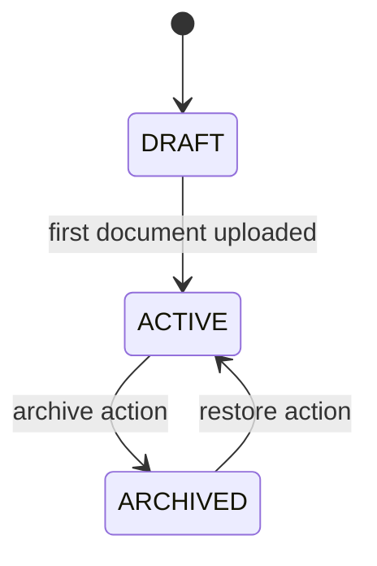
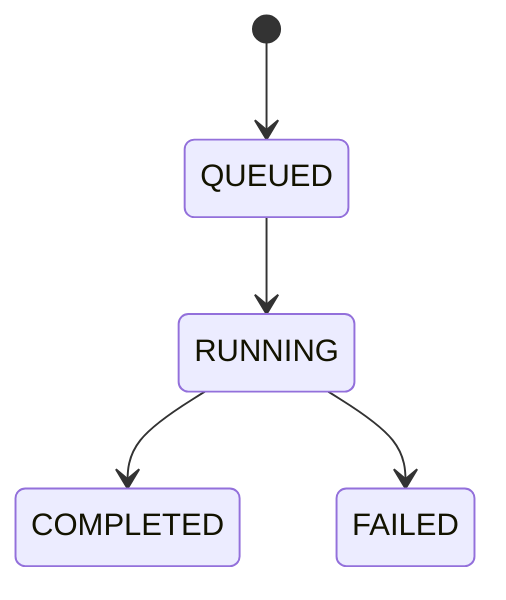
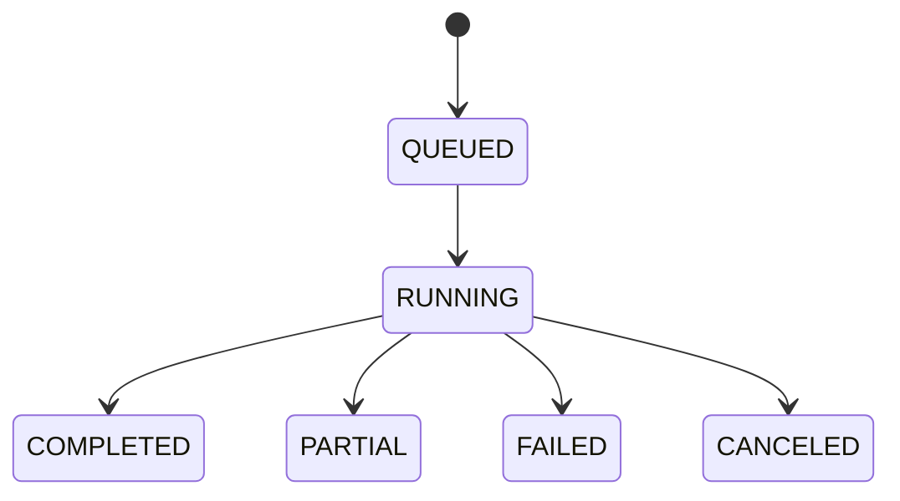
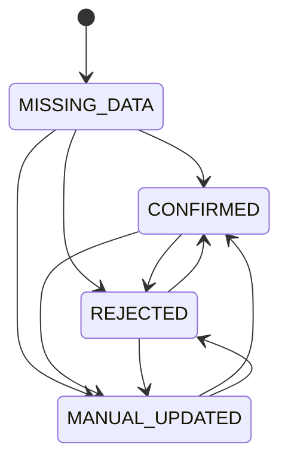

# Architecture Design

## System Overview
The system is a full-stack legal tabular review workflow:
1. Project lifecycle and versioned templates
2. Multi-format ingestion and parsing
3. Async extraction runs
4. Human review overlay with auditability
5. Evaluation against human labels
6. Optional diff/annotation layer

## Components

### Backend (`FastAPI`)
- Existing parser endpoints: `/convert`, `/render-pdf-page`, `/events`
- New workflow API: `/api/*`
- SQLite persistence (`backend/legal_review.db`)
- Async task orchestration via `request_tasks` + FastAPI `BackgroundTasks`

### Parsing Layer
- PDF: Docling worker + pdfium fallback
- HTML: Docling + DOM selector citations
- DOCX: Docling conversion
- TXT: plain-text parser

### Frontend (`React`)
- Project workspace tabs:
  - Documents
  - Templates
  - Table Review
  - Evaluation
  - Annotations
- Citation viewer reuse from existing components (`PdfCitationViewer`, `HtmlCitationViewer`)

## End-to-End Data Flow

1. Create project
2. Upload document -> parse task -> `document_versions`
3. Create/update template version -> extraction run task
4. Write immutable `field_extractions`
5. Reviewer writes `review_decisions`
6. Table view resolves `effective_value`
7. Ground truth upload + evaluation run -> metrics

## State Machines

### Project

### Parse Task

### Extraction Run

### Review Overlay

## Storage Layout
- Primary persistence: SQLite tables in `backend/legal_db.py`
- Parsed artifacts stored as JSON in `document_versions.artifact_json`
- Citations preserved with stable location metadata (page/bbox or selector/offset)

## Reprocessing Policy
- New document: trigger extraction for active template version
- New template version: trigger extraction for all latest documents in project
- Extraction output is immutable per run; manual review stored separately as overlay
