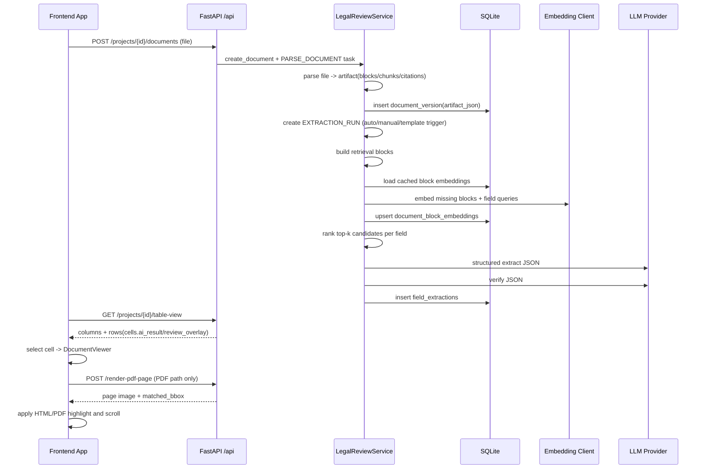

# Architecture Design

## 1. Purpose and Scope
This document describes the implemented architecture for the Legal Tabular Review system.

Primary production path:
- Frontend React workspace calling backend `/api/*` workflow endpoints.
- Backend extraction pipeline running in `hybrid` and `deterministic` modes.

Explicitly out of main scope:
- Legacy frontend-direct Gemini extraction path in `frontend/services/geminiService.ts`.
- That legacy path is kept in the repo but is not part of the accepted end-to-end workflow.

## 2. System Boundaries
### Frontend
- Single-page React app (`frontend/App.tsx`) with tabs for `documents`, `templates`, `table`, `evaluation`, `annotations`.
- Uses `frontend/services/legalReviewApi.ts` as the only workflow API client.
- Polls `/api/tasks/{task_id}` to track background processing.

### Backend
- FastAPI application (`backend/app.py`) with router mount for `/api/*` (`backend/legal_api.py`).
- Service layer (`backend/legal_service.py`) implements project/document/template/extraction/review/evaluation logic.
- Parser layer (`backend/parsers/*`) supports PDF, DOCX, HTML, TXT ingestion.
- SQLite persistence (`backend/legal_db.py`).
- LLM provider switch via `LEGAL_LLM_PROVIDER` (`openai` default, `gemini` optional).

### Storage
- SQLite DB file: `backend/legal_review.db` by default (`LEGAL_REVIEW_DB` override supported).
- Core persistent entities:
  - projects, documents, document_versions
  - field_templates, field_template_versions
  - extraction_runs, field_extractions
  - document_block_embeddings (persisted retrieval embeddings cache)
  - review_decisions, annotations
  - ground_truth_sets, ground_truth_labels, evaluation_runs
  - request_tasks, audit_events

## 3. End-to-End Data Flow
1. Project creation:
   - `POST /api/projects` creates a project in `DRAFT`.
2. Document ingestion:
   - `POST /api/projects/{project_id}/documents` creates a document record and async parse task.
   - Parse task converts file to artifact (markdown + blocks + citations + metadata) and creates a `document_version`.
3. Template configuration:
   - `POST /api/projects/{project_id}/templates` creates template + initial template version.
   - `POST /api/templates/{template_id}/versions` adds immutable template versions.
4. Extraction:
   - Runs created by document addition, template creation/update, or manual trigger.
   - `run_extraction` produces one `field_extractions` row per `(document_version, field)` cell.
5. Review:
   - `POST /api/projects/{project_id}/review-decisions` overlays human decision/manual value without deleting AI output.
6. Table comparison:
   - `GET /api/projects/{project_id}/table-view` aligns extracted cells across docs and computes baseline diffs.
7. Evaluation:
   - Ground truth set + evaluation run compare extracted outputs to labeled references and persist metrics.

## 4. Extraction Architecture
### Deterministic mode
- Keyword-driven block selection.
- Typed normalization (`date`, `number`, `boolean`, `list`, `text`).
- Citation carry-through from selected block.
- No LLM dependency.

### Hybrid mode (default)
- Retrieval over parsed artifact blocks.
- OpenAI Responses API extraction + verifier pass by default (OpenAI models + `reasoning.effort`).
- Explicit provider selection (`LEGAL_LLM_PROVIDER=openai|gemini`), no implicit provider fallback.
- Signal-combined confidence scoring.
- Retrieval embeddings use OpenAI `text-embedding-3-small` with persisted cache in `document_block_embeddings`.
- Retrieval falls back to local hash embeddings if OpenAI embeddings are unavailable.
- Automatic fallback to deterministic mode if LLM path fails.
- Default quality profile is `fast` (`balanced` and `high` remain available).

### LLM reasoning mode
- Retrieval + LLM extraction without deterministic fallback guarantees.
- Returns `MODEL_ERROR` fallback payload if LLM fails.

## 5. Async Model and Task Tracking
- Async workflows create `request_tasks` records and execute background jobs:
  - `PARSE_DOCUMENT`
  - `EXTRACTION_RUN`
  - `EVALUATION_RUN`
- Frontend polls task status (`QUEUED`, `RUNNING`, terminal states) and refreshes context when tasks complete.
- Task cancellation APIs can cancel individual tasks or all pending project tasks.

## 6. Regeneration Behavior
- Template creation triggers extraction when parsed documents already exist (`trigger_reason=TEMPLATE_CREATED`).
- Template version creation always triggers extraction (`trigger_reason=TEMPLATE_VERSION_UPDATED`).
- Document upload triggers extraction if an active template version exists (`trigger_reason=DOCUMENT_ADDED`).
- Manual extraction endpoint triggers on demand (`trigger_reason=MANUAL_TRIGGER`).

## 7. Error and Fallback Behavior
- Unsupported uploads: `415`.
- Empty uploads: `400`.
- Missing entities: `404` Problem JSON.
- Extraction uncertainty captured per cell:
  - `fallback_reason`: `NOT_FOUND`, `AMBIGUOUS`, `PARSER_ERROR`, `MODEL_ERROR`.
  - `verifier_status`: `PASS`, `PARTIAL`, `FAIL`, `SKIPPED`.
  - `uncertainty_reason` with operator-facing detail.

## 8. Hybrid Pipeline Deep Dive
This section describes the implemented pipeline from upload to table cell rendering and citation highlighting.

### 8.1 Upload and parse to structured artifact
1. Frontend uploads file via `POST /api/projects/{project_id}/documents`.
2. Backend validates project and file bytes, then MIME-routes by extension/content signature.
3. A `PARSE_DOCUMENT` task is created and run in background.
4. Parse worker converts the source into an artifact:
   - `markdown`
   - structural `blocks`
   - `chunks` (table blocks preserved as single chunks)
   - `citation_index`
   - metadata (`parser`, `dom_map_size`, `worker_error`, `page_index`)
5. Artifact is persisted in `document_versions.artifact_json`.

Format-specific citation anchors:
- PDF: page and bbox anchors (Docling; fallback to PDFium extraction if needed).
- HTML: CSS selector + char offsets via DOM map attachment.
- TXT/DOCX: char-span based text anchors.

### 8.2 Extraction run orchestration
1. Extraction run is created with `mode` and `quality_profile` (`fast` default).
2. Run startup computes `total_cells = latest_document_versions x template_fields`.
3. Service precomputes field-query embeddings (one per field) when embedding client is enabled.
4. For each cell `(document_version, field)`, `_extract_field_cell` is invoked.

### 8.3 Retrieval blocks and embedding cache
Per document-version:
1. Artifact blocks are normalized into retrieval blocks with stable `block_id`, normalized text, and doc-version-scoped citations.
2. Block embeddings are loaded from/persisted to `document_block_embeddings` keyed by:
   - `document_version_id`
   - `block_id`
   - `model`
3. Missing block embeddings are batch-generated via OpenAI Embeddings API (`OPENAI_EMBEDDING_MODEL`, default `text-embedding-3-small`).

### 8.4 Candidate ranking
For each field:
1. Query is expanded from field metadata (`name + prompt + type`) plus legal synonym expansion.
2. Candidate scoring uses:
   - semantic cosine similarity (query embedding vs block embedding)
   - lexical token overlap
   - table structure prior
3. Final score formula:
   - `final = 0.5*semantic + 0.3*lexical + 0.2*structure_prior`
4. If embeddings are unavailable, semantic similarity falls back to local 256-dim hash embeddings.
5. Top-k candidates are selected (`8/6/4` for `high/balanced/fast`).

### 8.5 Structured LLM extraction and verification
1. Provider is selected by `LEGAL_LLM_PROVIDER`:
   - `openai` (default) via Responses API
   - `gemini` optional
2. Extraction prompt requires strict JSON output:
   - `value`, `raw_text`, `evidence_summary`, `candidate_index`, `confidence`
3. Verifier prompt returns:
   - `verifier_status` (`PASS|PARTIAL|FAIL`)
   - `reason`
   - `best_candidate_index`
4. If verifier returns `FAIL`, retrieval is expanded (`top_k=12`) and extract/verify is retried.
5. In `high` quality profile, self-consistency is checked by re-extracting over reversed candidate order.

### 8.6 Post-processing and cell persistence
1. Selected candidate sets citations and source evidence.
2. Value normalization runs by field type (`date`, `number`, `boolean`, `list`, `text`).
3. Confidence is recalculated from multiple signals:
   - base LLM confidence
   - retrieval score
   - verifier status
   - self-consistency
4. Uncertainty fields are populated as needed:
   - `fallback_reason`
   - `verifier_status`
   - `uncertainty_reason`
5. Cell is persisted in `field_extractions`.
6. Run status resolves to `COMPLETED`, `PARTIAL`, `FAILED`, or `CANCELED`.

### 8.7 Table assembly
`GET /api/projects/{project_id}/table-view` returns:
- `columns`: template fields
- `rows`: latest document versions
- each cell:
  - `ai_result`
  - `review_overlay`
  - `effective_value` (manual override when `MANUAL_UPDATED`)
  - `is_diff` (baseline comparison)

Baseline logic:
- Uses `baseline_document_id` if provided.
- Otherwise defaults to the first document with a latest version.

### 8.8 Citation highlighting path (HTML/PDF/markdown fallback)
Frontend converts a selected cell into viewer payload (`quote`, `page`, `citations`) and opens `DocumentViewer`.

HTML rendering path:
1. Uses artifact `preview_html`.
2. `HtmlCitationViewer` sanitizes HTML and injects highlight CSS.
3. Target resolution order:
   - CSS selector from citation
   - snippet text search fallback
4. Highlight style:
   - range highlight via `start_char/end_char` when available
   - block-level highlight otherwise
5. Viewer scrolls to centered citation target.

PDF rendering path:
1. Requires original PDF bytes (`sourceContentBase64`) in viewer payload.
2. `PdfCitationViewer` calls `POST /render-pdf-page` with:
   - file
   - page
   - scale
   - snippet
3. Backend renders a PNG page and resolves `matched_bbox`:
   - exact text search first
   - normalized fuzzy search fallback
4. Frontend overlays bbox and scrolls to the citation region.

Current UI behavior note:
- If original PDF bytes are not provided to viewer state, PDF falls back to markdown preview highlighting.

### 8.9 Sequence view

## 9. Scope Coverage Matrix (All 8 Areas)
| Scope Area | Implemented In | Architectural Outcome |
| --- | --- | --- |
| 1. Product & data model alignment | `legal_service.py`, `legal_db.py`, `/api/*` | Project/document/template/extraction/review/eval lifecycle persisted with auditable overlays |
| 2. Document ingestion & parsing | `/api/projects/{id}/documents`, `parsers/*`, `mime_router.py` | Multi-format parsing with structural blocks, citations, metadata |
| 3. Field template/schema management | template endpoints + version tables | Versioned field schema with validation/normalization policies |
| 4. Field extraction workflow | extraction run endpoints + service extraction methods | Per-cell output includes value/raw/normalized/confidence/citations/fallback diagnostics |
| 5. Tabular comparison & review | `/table-view`, review decision endpoints | Aligned table with AI result + human overlay + effective value + diff flag |
| 6. Quality evaluation | ground truth + evaluation run endpoints | Persisted metrics and qualitative mismatch notes |
| 7. Optional diff & annotation layer | `is_diff` in table view + annotation endpoints | Non-destructive annotation and baseline comparison |
| 8. Frontend experience | `frontend/App.tsx` tabs + task polling | Project-centric UX for ingestion, schema, review, tracking, and evaluation |
