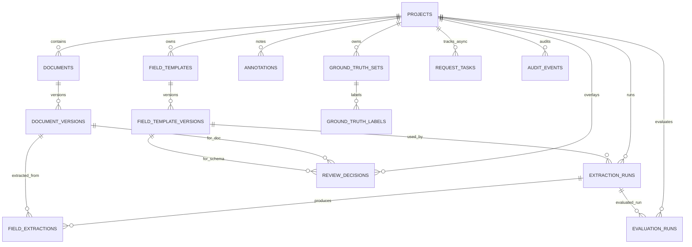

# Data Model

## 1. Data Model Goals
The data model supports:
- Persistent project lifecycle management.
- Multi-version documents and template schemas.
- Cell-level extraction outputs with evidence, confidence, and normalization.
- Human review overlays and annotations without deleting AI output.
- Evaluation against ground truth labels.
- Auditable async task execution.

## 2. Core Entities
| Entity | Key Fields | Purpose |
| --- | --- | --- |
| `projects` | `id`, `name`, `status`, `description` | Top-level workspace container |
| `documents` | `id`, `project_id`, `filename`, `source_mime_type`, `sha256` | Uploaded source docs |
| `document_versions` | `id`, `document_id`, `version_no`, `parse_status`, `artifact_json` | Immutable parsed snapshots |
| `field_templates` | `id`, `project_id`, `name`, `status`, `active_version_id` | Template handle per project |
| `field_template_versions` | `id`, `template_id`, `version_no`, `fields_json`, policies | Immutable schema versions |
| `extraction_runs` | `id`, `project_id`, `template_version_id`, `mode`, `quality_profile`, `status` | Batch extraction executions |
| `field_extractions` | run/doc/field foreign keys + extraction payload fields | One extraction result per table cell |
| `review_decisions` | `(project_id, document_version_id, template_version_id, field_key)` unique | Human review overlay |
| `annotations` | doc/template/field keys + `body`, `approved` | Optional non-destructive comments |
| `ground_truth_sets` | `id`, `project_id`, `name`, `format` | Label collection header |
| `ground_truth_labels` | `ground_truth_set_id`, `document_version_id`, `field_key`, expected values | Human reference labels |
| `evaluation_runs` | `id`, `project_id`, `ground_truth_set_id`, `extraction_run_id`, `metrics_json` | Persisted quality scoring |
| `request_tasks` | `id`, `task_type`, `status`, progress, payload | Async task tracking |
| `audit_events` | actor/action/entity/payload | Immutable audit trail |

## 3. Entity Relationship View

## 4. Canonical Cell Model (Extraction Output)
Each `field_extractions` row stores required review/evaluation fields:
- `value`
- `raw_text`
- `normalized_value`
- `normalization_valid`
- `confidence_score`
- `citations_json`
- `evidence_summary`
- `fallback_reason`
- `extraction_method`
- `model_name`
- `retrieval_context_json`
- `verifier_status`
- `uncertainty_reason`

This model satisfies the acceptance requirement that extracted fields include value, citations, confidence, and normalization output.

## 5. Endpoint-to-Entity Mapping (Summary)
| Endpoint Group | Primary Entities Touched |
| --- | --- |
| Project APIs | `projects`, `audit_events` |
| Document upload/parse | `documents`, `document_versions`, `request_tasks`, optional `extraction_runs`, `field_extractions` |
| Template/version APIs | `field_templates`, `field_template_versions`, optional `extraction_runs`, `request_tasks`, `field_extractions` |
| Extraction APIs | `extraction_runs`, `field_extractions`, `request_tasks`, `audit_events` |
| Table view APIs | read `document_versions`, `field_extractions`, `review_decisions` |
| Review APIs | `review_decisions`, `audit_events` |
| Annotation APIs | `annotations`, `audit_events` |
| Ground truth APIs | `ground_truth_sets`, `ground_truth_labels`, `audit_events` |
| Evaluation APIs | `evaluation_runs`, `request_tasks`, reads `field_extractions`, `ground_truth_labels` |
| Task control APIs | `request_tasks`, and associated `extraction_runs`/`evaluation_runs` cancellation status |

## 6. Status Enumerations
### Project
- `DRAFT`
- `ACTIVE`
- `ARCHIVED`

### Parse (document version)
- Enum includes: `QUEUED`, `RUNNING`, `COMPLETED`, `FAILED`
- Persisted values currently written by parsing flow: `COMPLETED`, `FAILED`

### Extraction run
- `QUEUED`, `RUNNING`, `COMPLETED`, `PARTIAL`, `FAILED`, `CANCELED`

### Review
- `CONFIRMED`, `REJECTED`, `MANUAL_UPDATED`, `MISSING_DATA`

### Task
- `QUEUED`, `RUNNING`, `SUCCEEDED`, `FAILED`, `CANCELED`

### Evaluation run
- `QUEUED`, `RUNNING`, `COMPLETED`, `FAILED`, `CANCELED`

### Extraction diagnostics
- `fallback_reason`: `NOT_FOUND`, `AMBIGUOUS`, `PARSER_ERROR`, `MODEL_ERROR`
- `verifier_status`: `PASS`, `PARTIAL`, `FAIL`, `SKIPPED`

## 7. Status Transition Rules
### Project transitions
| From | To | Trigger |
| --- | --- | --- |
| `DRAFT` | `ACTIVE` | First document creation updates project status |
| `DRAFT/ACTIVE/ARCHIVED` | `DRAFT/ACTIVE/ARCHIVED` | `PATCH /api/projects/{project_id}` with valid status |
| Any | deleted | `DELETE /api/projects/{project_id}` (or compatibility POST delete) |

### Extraction run transitions
| From | To | Trigger |
| --- | --- | --- |
| `QUEUED` | `RUNNING` | Extraction worker starts |
| `RUNNING` | `COMPLETED` | All cells extracted without fallback |
| `RUNNING` | `PARTIAL` | Mix of successful and fallback cells |
| `RUNNING` | `FAILED` | All cells failed or hard failure |
| `QUEUED/RUNNING` | `CANCELED` | Task cancellation or cancellation signal |

### Task transitions
| From | To | Rule |
| --- | --- | --- |
| `QUEUED` | `RUNNING` | Worker began processing |
| `RUNNING` | `SUCCEEDED` | Worker completed successfully |
| `RUNNING` | `FAILED` | Worker exception/failure |
| `QUEUED/RUNNING` | `CANCELED` | Cancel endpoint |
| `SUCCEEDED/FAILED/CANCELED` | active state | Blocked by service rules |

### Review state behavior
- Review rows are upserted per unique cell key.
- Any review status can be replaced by a later upsert.
- `MANUAL_UPDATED` stores `manual_value`; AI extraction row remains unchanged.

### Evaluation run transitions
| From | To | Trigger |
| --- | --- | --- |
| `QUEUED` | `RUNNING` | Evaluation worker starts |
| `RUNNING` | `COMPLETED` | Metrics computed and saved |
| `RUNNING` | `FAILED` | Worker failure path |
| `QUEUED/RUNNING` | `CANCELED` | Cancellation path |

## 8. Regeneration and Reprocessing Rules
- New document with active template: create extraction run (`DOCUMENT_ADDED`).
- New template version: create extraction run (`TEMPLATE_VERSION_UPDATED`).
- New template with existing parsed docs: create extraction run (`TEMPLATE_CREATED`).
- Manual re-run: `POST /api/projects/{project_id}/extraction-runs`.
- Table view always reads the latest completed/partial run for selected template version.

## 9. Scope Coverage Mapping (All 8 Areas)
| Scope Area | Data Model Support |
| --- | --- |
| 1. Product/data model alignment | Full project-document-template-extraction-review-eval schema |
| 2. Document ingestion/parsing | `documents`, `document_versions.artifact_json`, parse statuses |
| 3. Field template/schema | `field_templates`, `field_template_versions`, policy JSON |
| 4. Field extraction workflow | `extraction_runs`, `field_extractions` rich per-cell payload |
| 5. Tabular comparison/review | `field_extractions` + `review_decisions` overlay key |
| 6. Quality evaluation | `ground_truth_*` + `evaluation_runs.metrics_json` |
| 7. Diff/annotation | `annotations`, plus computed `is_diff` in table view response |
| 8. Frontend UX backing model | `request_tasks` and run/status fields support UI tracking |
